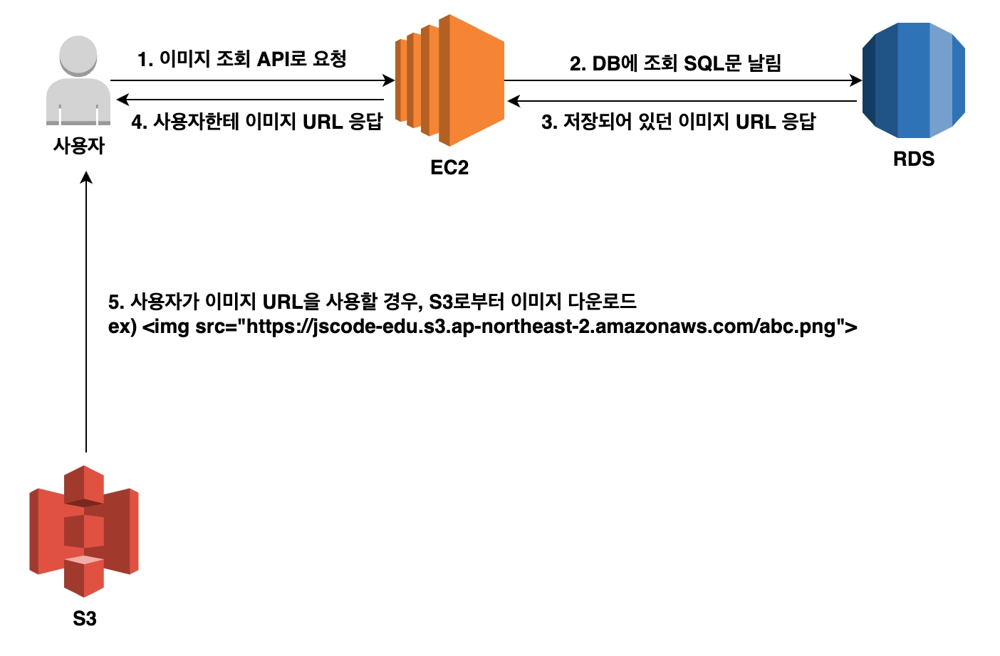
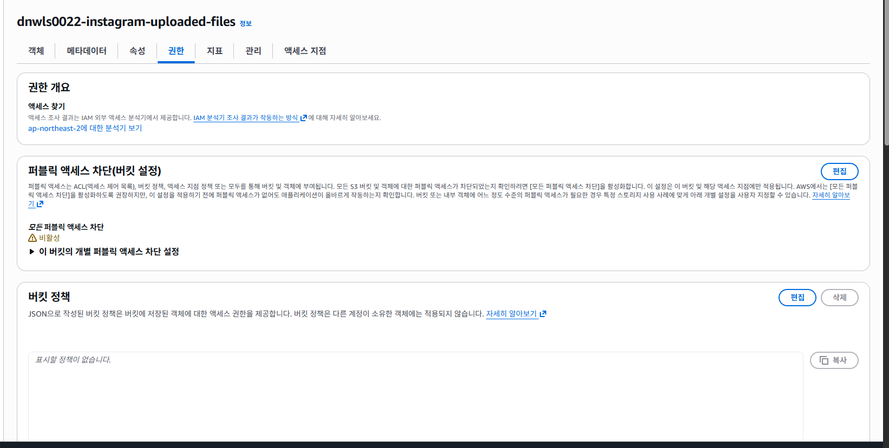
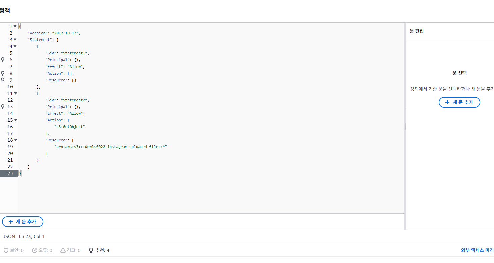
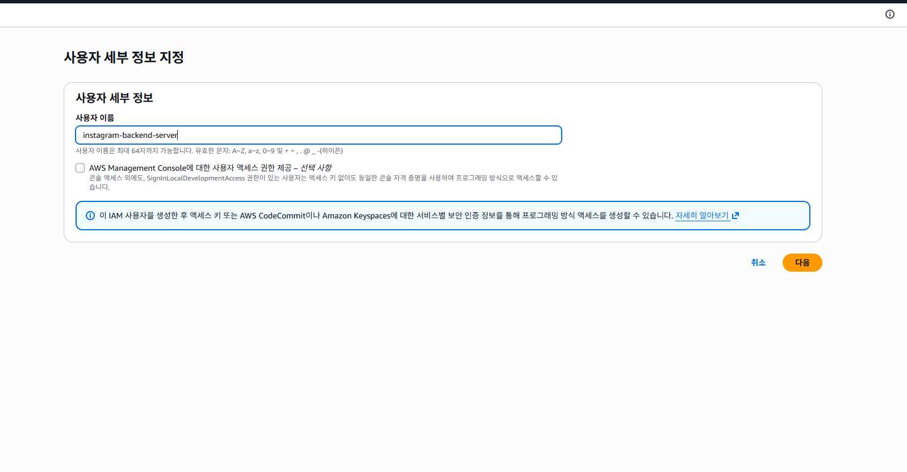
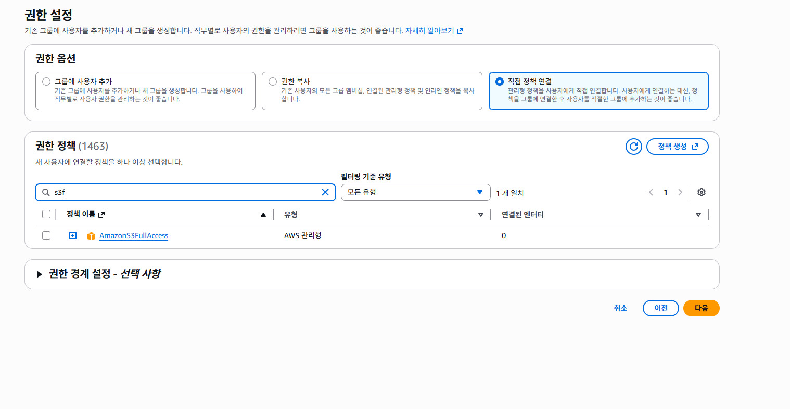
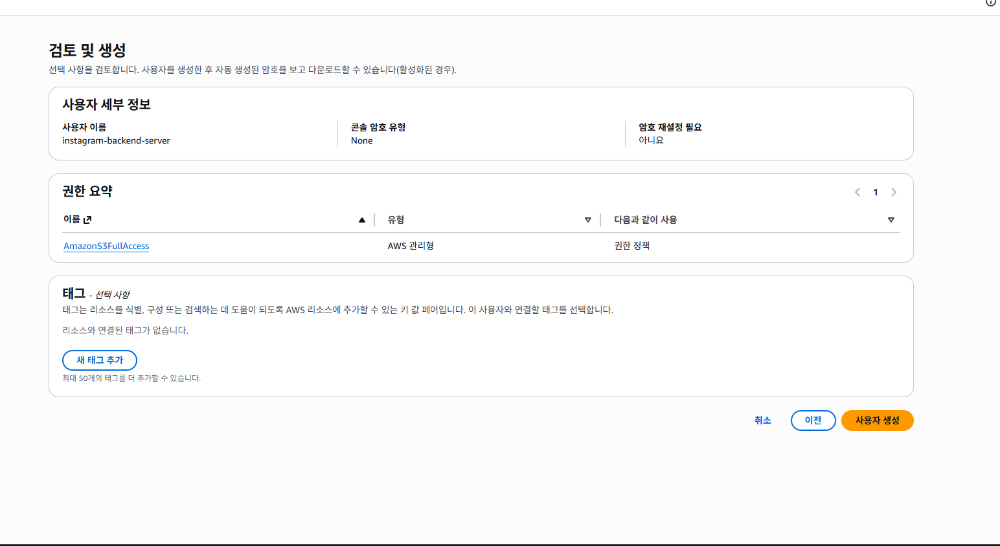
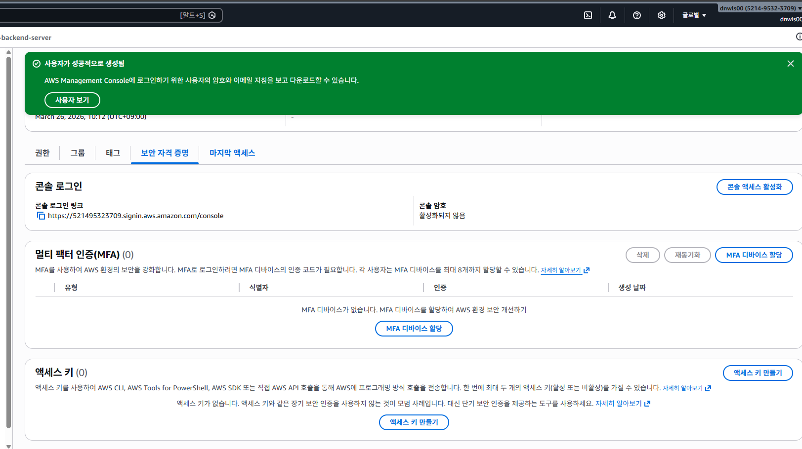
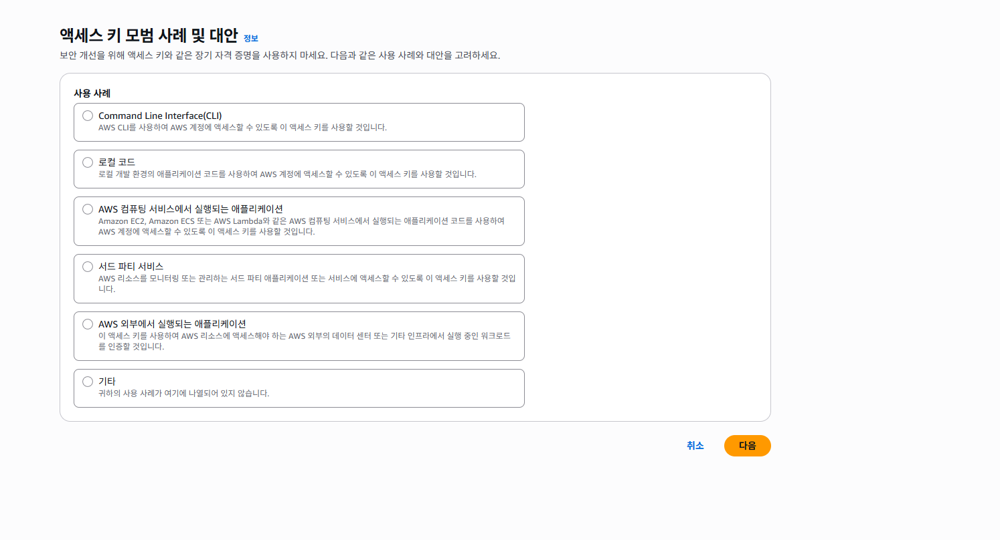
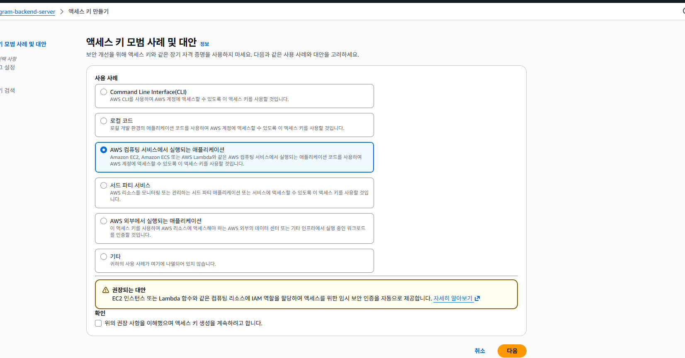

# 복귀 첫날

# S3
AWS에서 제공하는 파일 저장 서비스이름, 
폰으로 사진찍으면 구글드라이브, 아이클라우드에 저장됨 이와유사.

1. 버킷 : 구글 드라이브에서 공유 드라이브를 만들수있는것처럼 S3에서도 저장소를 여러개만들수잇음
이를버킷.

2. 객체: S3에선 버킷에 업로드한 *파일을객체*라고함 이 객체는 키벨류쌍으로  이루어져있음. 키는 객체에 할당한 이름, 값은 업로드한 컨텐츠자체를의미. 

# S3사용이유
보편적으로 사용되는 분야는 이미지업로드가능, 업로드된 이미지파일은 백엔드서버가 실행되는 EC2인스턴스내부에 저장하는 것도가능하지만. 파일개수가 많아지면 관리가어렵다. 파일 저장 공간이 한정되어있거 RDS와 마찬가지로 EC2인스턴스에 이상이 생길경우 데이터 손실문제도 있다.

- S3은 파일용량에 제한이없고 사용자의 필요에 따라 자동으로 확장된다. 
데이터를 여러 물리적위치에 분산하여저장. 데이터손실확률이 매우희박.
# 이미지업로드 과정

# 이미지 다운로드 과정


# S3버킷 생성
특히 퍼블릭 액세스관련

퍼블릭 액세스란 익명의 사용자도 S3의 객체를 다운 받을 수 있게끔 한다는 의미.
사용자들이 웹 브라우저에서 S3에 있는 이미지를 볼 수 있게 하려면 다음과 같이 퍼블릭엑세스 차단설정을 모두해제.
차단 해제 해두면 객체가 퍼블릭 상태가 된다는점을 안내하는 WARN이 뜨는데 이번 예제에서는 이미지를 모든 사용자에게 공개하는것이 목적이라 퍼블릭으로함.

# 버킷 사용을 위한 정책 설정.
AWS에서 S3버킷을 포함한 자원을 생성하면 기본적으로 모든권한이 차단되어있음. 즉 이미지를 업로드하더라도, 별도로 권한설정을 하지않으면 다른 사용자들은 버킷 내에 있는 객체에 접근하는것이 불가.

AWS에서는 정책을활용하여 특정 자원에 접근할수잇는 권한부여가능.
- 정책(policy) : 권한(Permisson)을 정의하는 json문서
이상의 정책 개념을 활영하여 특정 사용자 또는 서비스가 S3버킷의 파일을 열거나 수정가능하도록 설정가능.

- 




- 권한 -> 정책 -> 편집버튼
- 현재 저희 권한설정 목표는 모든 사용자가 해당버킷의 모든 객체에 접근가능하도록 설정. 


- arn : 
- principle
인증이이뤄진아이

```json
{
    "Version": "2012-10-17",  # 정책을 작성하는 문법의버전
    "Statement": [
        {
            "Sid": "Statement2",  #정책끼리 구별하기 위한 식별값
            "Effect": "Allow",    #기재된 권한을 허용함
            "Principal": "*",     # 
            "Action": "s3:GetObject", # 
            "Resource": "arn:aws:s3:::dnwls0022-instagram-uploaded-files/*"
            # dnwls0022-instagram-uploaded-files 의 모든 대상
        }
    ]
}
```
# IAM 으로 S3사용권한 준비
버킷 정책으로 이제 사용자들은 S3에 저장된 파일을 내려받을수있다. 백엔드서버는 사용자가아니기에 여전히 S3에 접근하는것이불가. 
백엔드서버는 AWS SDK 라는 라이브러리를 사용해 S3와 같은 AWS 서비스에 요청을 보냄. 
이때 서비스에 접근가능한 권한이필요.
AWS SDK는 IAM 이라는 서비스에서 부여한 권한을 바탕으로 AWS 자원에 접근가능함. 
백엔드서버가 S3에 접근가능하도록 적절한 권한을가진  IAM 사용지ㅏ를 먼저만들어야함.

# IAM
Identity and Access Management 의 축약어. AWS 자원에 대한 접근권한을 제어하는 서비스. 
이를이용해 사용자에게 필요한 권한만 부여가능.

1. IAM사용자 
- IAM 에서 사용자는 특정권한이 부여된 출입증 정도로 생각하면된다. 예러 A라는 개발자에겐 EC2만 접근을 허용하도,  B에겐 RDS에만 접근을 허용하고 싶다가정. 해당경우 A와B에게 부여해야하는 권한이서로다름. A.B각각 출입증을 만들어야함

- IAM에서 사용자는 사람뿐아니라 특정 컴퓨터 또는 특정 프로그램에 부여하는 출입증으로 쓰임. 백엔드서버가 S3에 접근 가능하도록 권한을 부여하기위한 IAM사용자를생성.

# IAM 사용자 생성 및 엑세스 키 발급.




AmazonS3Full






엑세스 키 모범 사례 및 대안 파트확인. 


`AWS 컴퓨팅 서비스에서 실행되는 애플리케이션`
Amazon EC2, Amazon ECS 또는 AWS Lambda와 같은 AWS 컴퓨팅 서비스에서 실행되는 애플리케이션 코드를 사용하여 AWS 계정에 액세스할 수 있도록 이 액세스 키를 사용할 것입니다.


`AWS 외부에서 실행되는 애플리케이션`
이 액세스 키를 사용하여 AWS 리소스에 액세스해야 하는 AWS 외부의 데이터 센터 또는 기타 인프라에서 실행 중인 워크로드를 인증할 것입니다.

1. RDS생성 - instagram-db / Security Group / Parameter Group
2. 
3. 
4. 

# S3이미지파일업로드테스트

