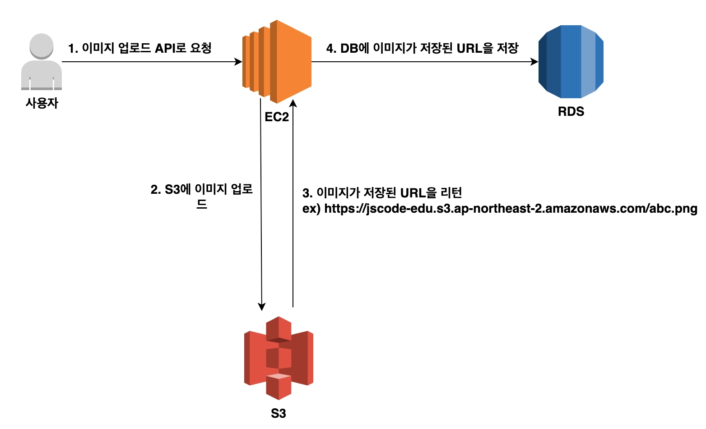

# 복귀 첫날

# S3
AWS에서 제공하는 파일 저장 서비스이름, 
폰으로 사진찍으면 구글드라이브, 아이클라우드에 저장됨 이와유사.

1. 버킷 : 구글 드라이브에서 공유 드라이브를 만들수있는것처럼 S3에서도 저장소를 여러개만들수잇음
이를버킷.

2. 객체: S3에선 버킷에 업로드한 *파일을객체*라고함 이 객체는 키벨류쌍으로  이루어져있음. 키는 객체에 할당한 이름, 값은 업로드한 컨텐츠자체를의미. 

# S3사용이유
보편적으로 사용되는 분야는 이미지업로드가능, 업로드된 이미지파일은 백엔드서버가 실행되는 EC2인스턴스내부에 저장하는 것도가능하지만. 파일개수가 많아지면 관리가어렵다. 파일 저장 공간이 한정되어있거 RDS와 마찬가지로 EC2인스턴스에 이상이 생길경우 데이터 손실문제도 있다.

- S3은 파일용량에 제한이없고 사용자의 필요에 따라 자동으로 확장된다. 
데이터를 여러 물리적위치에 분산하여저장. 데이터손실확률이 매우희박.
# 이미지업로드 과정

# 이미지 다운로드 과정

# S3버킷 생성
특히 퍼블릭 액세스관련

퍼블릭 액세스란 익명의 사용자도 S3의 객체를 다운 받을 수 있게끔 한다는 의미.
사용자들이 웹 브라우저에서 S3에 있는 이미지를 볼 수 있게 하려면 다음과 같이 퍼블릭엑세스 차단설정을 모두해제.
차단 해제 해두면 객체가 퍼블릭 상태가 된다는점을 안내하는 WARN이 뜨는데 이번 예제에서는 이미지를 모든 사용자에게 공개하는것이 목적이라 퍼블릭으로함.

# 버킷 사용을 위한 정책 설정.
AWS에서 S3버킷을 포함한 자원을 생성하면 기본적으로 모든권한이 차단되어있음. 즉 이미지를 업로드하더라도, 별도로 권한설정을 하지않으면 다른 사용자들은 버킷 내에 있는 객체에 접근하는것이 불가.

AWS에서는 정책을활용하여 특정 자원에 접근할수잇는 권한부여가능.
- 정책(policy) : 권한(Permisson)을 정의하는 json문서
이상의 정책 개념을 활영하여 특정 사용자 또는 서비스가 S3버킷의 파일을 열거나 수정가능하도록 설정가능.

- 

- 권한 -> 정책 -> 편집버튼
- 현재 저희 권한설정 목표는 모든 사용자가 해당버킷의 모든 객체에 접근가능하도록 설정. 

- arn : 
- principle
인증이이뤄진아이